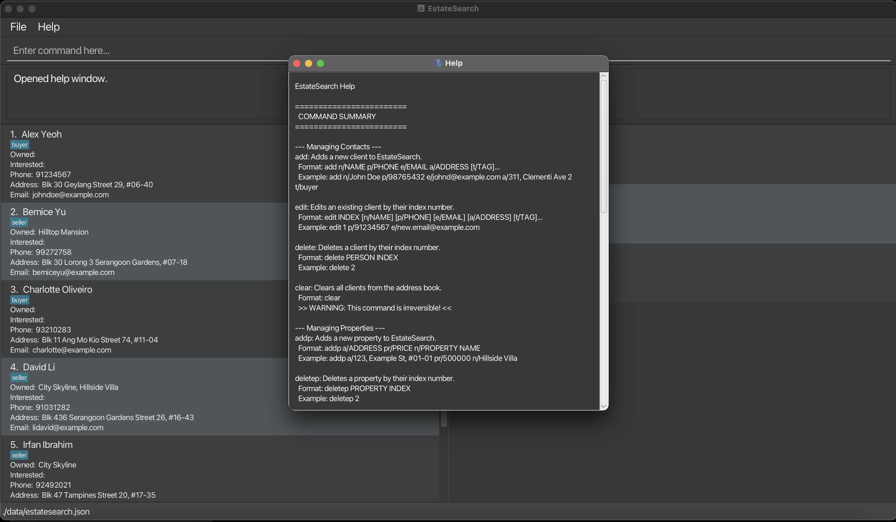
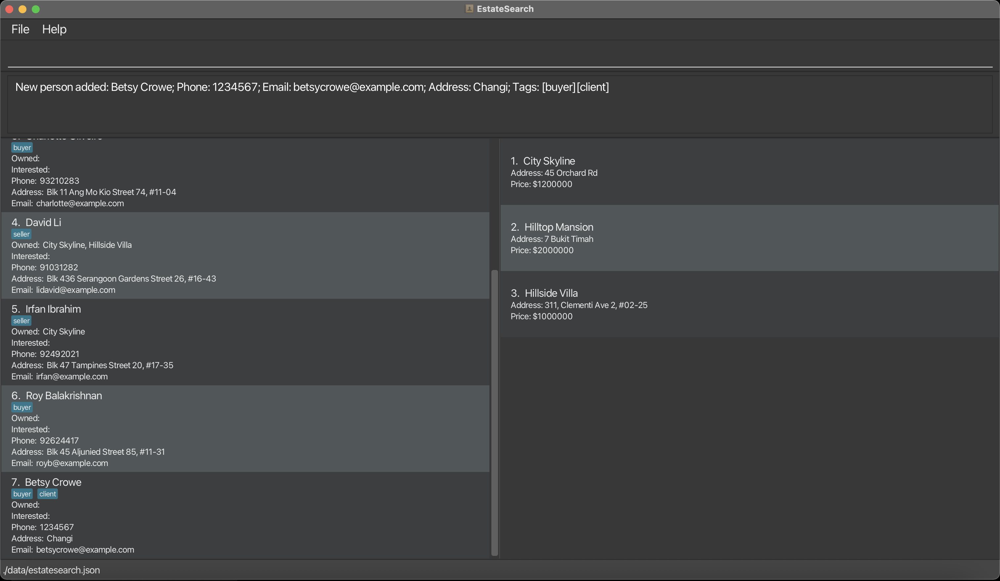
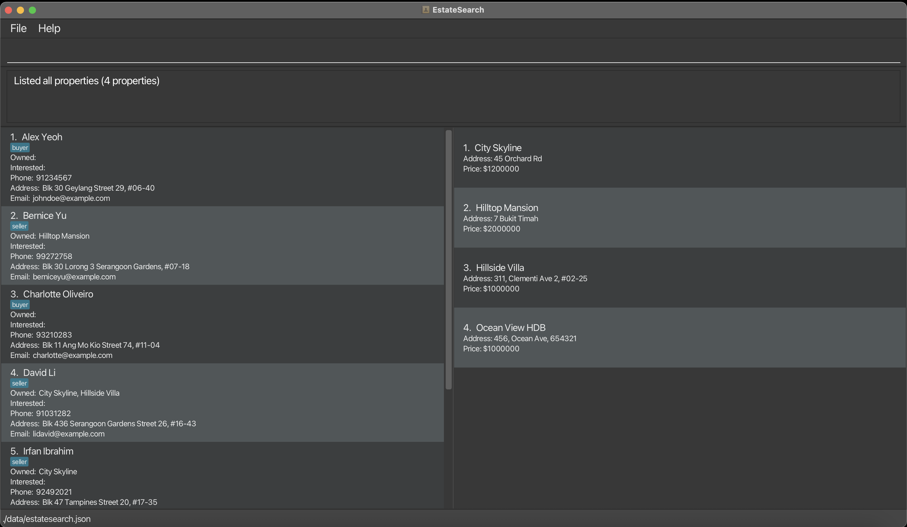
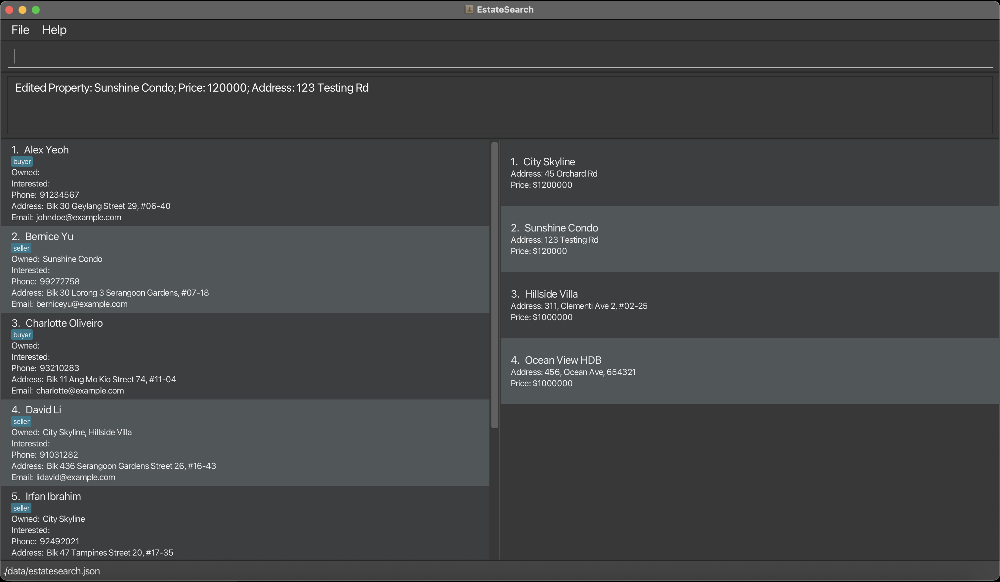
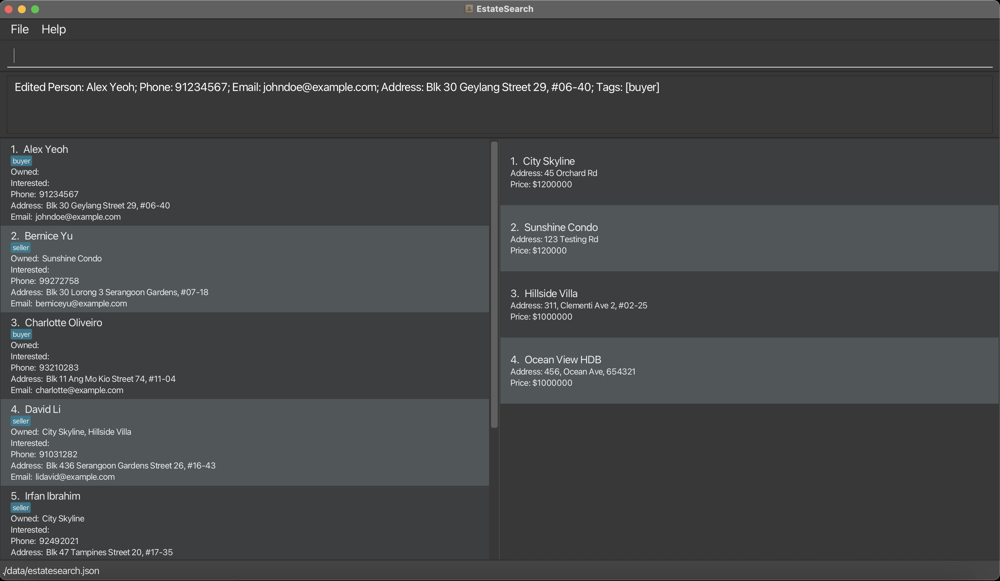
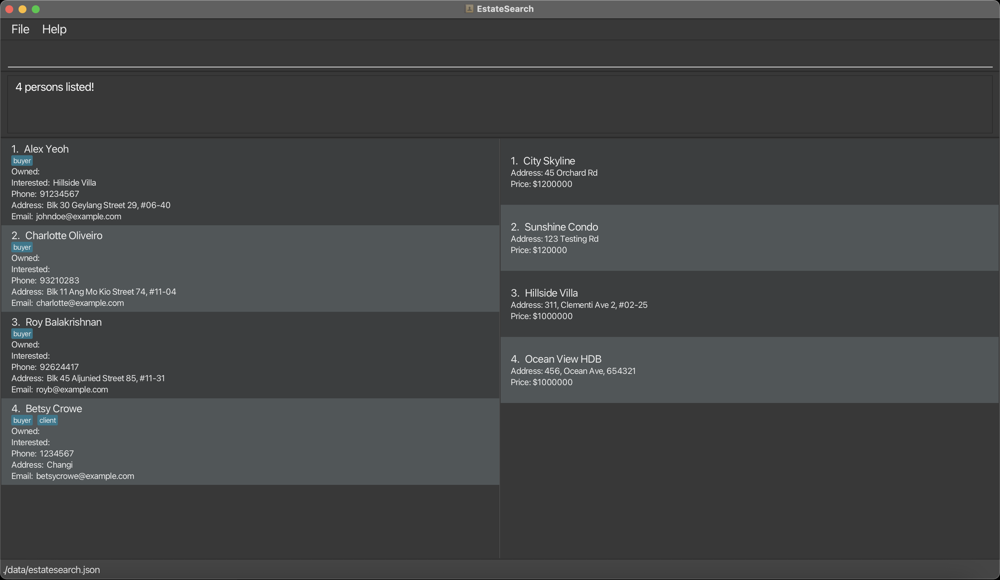
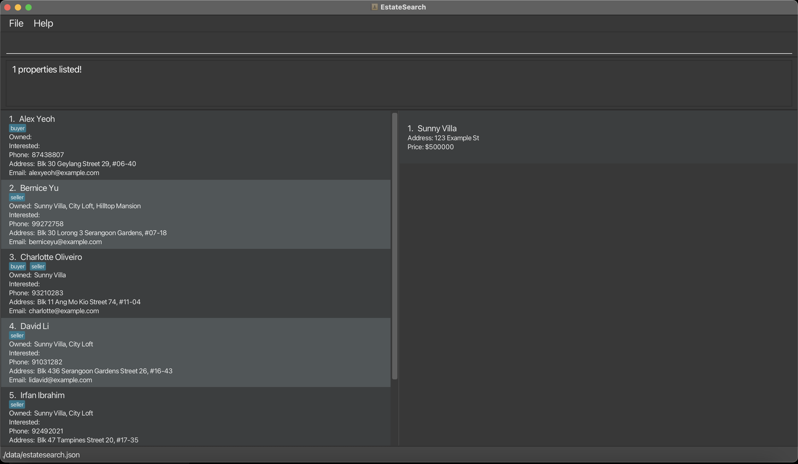
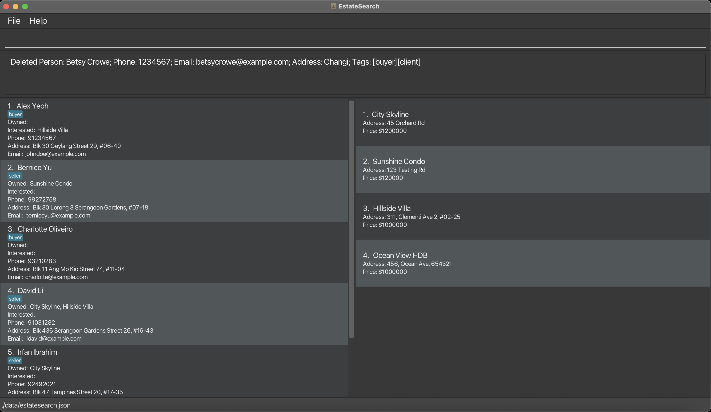
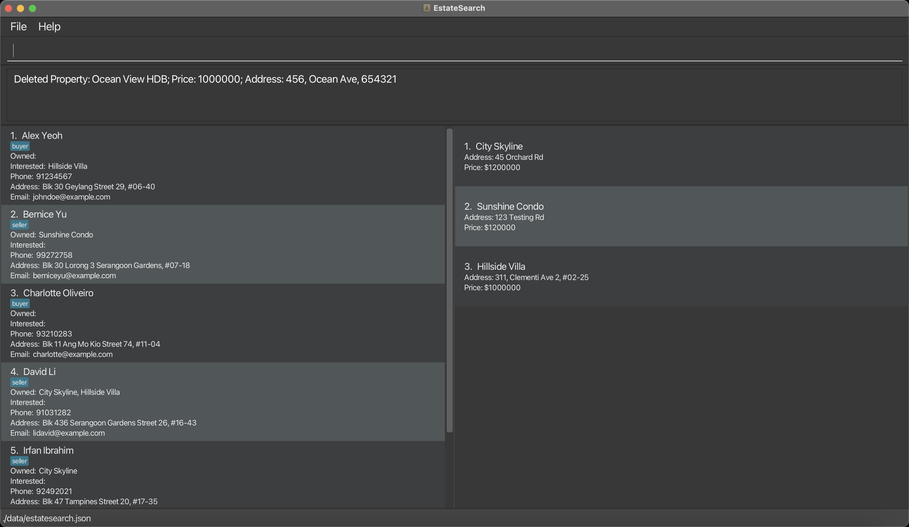

# Welcome to EstateSearch!

**EstateSearch** is a desktop application that is designed specifically for **real estate agents** who are looking
for a tool that allows them to be fast and efficient through the use of a **Command-Line Interface (CLI)**.
Along with a dual view **Graphical User Interface (GUI)**, you will be able to manage your client contacts, 
organize property details, as well as client-property relations at significantly faster speeds than traditional 
GUI-only applications. For the fast-typing real estate agent or property manager, **EstateSearch** is designed to
keep up with your pace for productivity gains.

<box type="tip">

**Tip**
For any terms that you are not familiar with, do refer to the Glossary of Terms below.

</box>

<!-- * Table of Contents -->
<page-nav-print />

--------------------------------------------------------------------------------------------------------------------
## How to use this User Guide

This User Guide is designed to help you navigate EstateSearch and maximise your productivity with the
available features. It's designed to walk you through all the application's features, from getting started to using 
advanced commands—no prior experience is necessary. Explore the sections below to begin:

1. **Table of Contents**:
   You’ll find this on the right side of the User Guide. Click any section to jump straight to it.
2. [**Getting Started**](#getting-started):
A simple step-by-step guide for new users to follow and get acquainted with EstateSearch’s interface
and basic functions.
3. [**Command Summary**](#estatesearch-command-summary):
The command summary is a good reference as it provides a general overview of all the available
commands. Use the command summary when you need to clarify input formats for a command without having to go too in-depth
regarding its usage.
4. [**Features**](#features):
Explore all the features that EstateSearch has to offer. This section offers in-depth information on every command
including information such as command formats, examples, and screenshots of expected outputs.
5. [**FAQ**](#faq):
This section contains answers to the most commonly asked questions regarding EstateSearch's functionality or issues
that are not brought up in other sections.
6. [**Known Issues**](#known-issues):
This section contains several known issues with usage of EstateSearch. If you face any unexpected behaviour do checkout
this section for fixes.
7. [**Glossary**](#glossary):
If you encounter any unfamiliar terms in this User Guide, refer to the Glossary of Terms, which acts as a quick
dictionary of key terms used in the EstateSearch.
8. [**Acceptable Range for Input Parameters**](#acceptable-value-range-for-parameters):
Detailed information on valid inputs and constraints for commands. This section is useful for ensuring that your
command inputs are valid and satisfy the required constraints.

### Alert Boxes
Within the User Guide, you will see these boxes appear, providing additional context or information.

<box type="info">

**Info**: These boxes provide additional information relevant to the current context.

</box>
<box type="tip">

**Tip**: Look out for tips that can help to improve your user experience and learn how to best use a feature.

</box>
<box type="warning">

**Warning**: Pay attention to these warnings to avoid common pitfalls.

</box>

---
## Getting Started

1. Ensure you have Java `17` or above installed in your Computer. 
   **Mac users:** Ensure you have the precise JDK version prescribed [here](https://se-education.org/guides/tutorials/javaInstallationMac.html).

<box type="tip">

**Tip**: 
Finding Your Java Version:

On Windows: 
* Open the **Start Menu** and search for **Command Prompt** or **PowerShell**.
* In the application, type the command java -version and press Enter.
* Refer to this [guide](https://se-education.org/guides/tutorials/javaInstallationWindows.html) for installation of Java `17`.

On macOS:
* Open **Finder** (Cmd + Space) and search for **Terminal**.
* In the Terminal, type java -version and press Enter.
* Refer to this [guide](https://se-education.org/guides/tutorials/javaInstallationMac.html) for installation of Java `17`.

</box>

2. Download the latest `.jar` file from [here](https://github.com/AY2526S1-CS2103T-W12-4/tp/releases/tag/v1.5).

3. Copy the file to the folder you want to use as the _home folder_ for your EstateSearch application.

4. Open a command terminal, `cd` into the folder you put the jar file in, and use the `java -jar estatesearch.jar` command to run the application. 
   A GUI similar to the below should appear in a few seconds. 
   

5. Type a command in the command box and press the <kbd>ENTER</kbd> key to execute it. e.g. typing **`help`** and pressing the <kbd>ENTER</kbd> key will open the help window. 
   Some example commands you can try:

   - `list` : Lists all contacts.

    * `add n/Edward Lim p/98765432 e/edwardl@gmail.com a/John street, block 123, #01-01` : Adds a client named `Edward Lim` to Estate Search.

    * `delete 3` : Deletes the 3rd client shown in the current list.

    * `clear` : Deletes all clients.

   - `exit` : Exits the app.

6. Refer to the [Features](#features) below for details of each command.

<box type="tip">

**Tip**:
When you first open EstateSearch, you will see that the application is populated with sample data. Feel free to test
out the features on the sample data to get comfortable with the app and its functions. Once you are ready to start
adding your own data, type in the <code>clear</code> command and press <kbd>ENTER</kbd>to reset all the client and
property data.
</box>

---

## EstateSearch Command Summary

| Action                  | Format, Examples                                                                                                                                                      |
|-------------------------| --------------------------------------------------------------------------------------------------------------------------------------------------------------------- |
| **Add** | `add n/NAME p/PHONE_NUMBER e/EMAIL a/ADDRESS [t/TAG]…​`   e.g., `add n/James Ho p/22224444 e/jamesho@example.com a/123, Clementi Rd, 1234665 t/client t/colleague` |
| **Clear**               | `clear`                                                                                                                                                               |
| **Delete**              | `delete INDEX`  e.g., `delete 3`                                                                                                                                   |
| **Edit**                | `edit INDEX [n/NAME] [p/PHONE_NUMBER] [e/EMAIL] [a/ADDRESS] [l/LISTING] [t/TAG]…​`  e.g.,`edit 2 n/James Lee e/jameslee@example.com`                               |
| **Find**                | `find n/NAME` or `find t/TAG`   e.g., `find n/James` `find t/client`                                                                                               |
| **List**                | `list`                                                                                                                                                                |
| **Help**                | `help`                                                                                                                                                                |
| **Export**              | `export FILENAME`                                                                                                                                                     |
| **Exit**                | `exit`                                                                                                                                                                |
| **Add Property**        | `addp n/NAME a/ADDRESS pr/PRICE`   e.g., `addp n/Sunshine Condo a/123, Sunshine Rd, 123456 pr/800000`                                                              |
| **Delete Property**     | `deletep INDEX`  e.g., `deletep 3`                                                                                                                                 |
| **Set Owned Property**  | `setop i/INDEX n/PROPERTY_NAME`  e.g., `setop i/1 n/City Loft`                                                                                                     |
| **Set Interested Property** | `setip i/INDEX n/PROPERTY_NAME`  e.g., `setip i/2 n/Sunshine Condo`                                                                                                |
| **Edit Property**       | `editp INDEX [n/NAME] [a/ADDRESS] [pr/PRICE]…​`  e.g.,`editp 2 n/Sunshine Condo pr/120000 a/ 123 Testing Rd`                                                       |
| **Find Property**       | `findp n/PROPERTY`   e.g., `find n/Sunshine Condo`                                                                                                                 |
| **List Property**       | `listp`                                                                                                                                                               |

---

## Features

<box type="info">

**Notes about the command format:** 

- Words in `UPPER_CASE` are the parameters to be supplied by the user. 
  e.g. in `add n/NAME`, `NAME` is a parameter which can be used as `add n/John Doe`.

- Items in square brackets are optional. 
  e.g `n/NAME [t/TAG]` can be used as `n/John Doe t/friend` or as `n/John Doe`.

- Items with `…`​ after them can be used multiple times including zero times. 
  e.g. `[t/TAG]…​` can be used as ` ` (i.e. 0 times), `t/friend`, `t/friend t/family` etc.

- Parameters can be in any order. 
  e.g. if the command specifies `n/NAME p/PHONE_NUMBER`, `p/PHONE_NUMBER n/NAME` is also acceptable.

- Extraneous parameters for commands that do not take in parameters (such as `help`, `list`, `exit` and `clear`) will be ignored. 
  e.g. if the command specifies `help 123`, it will be interpreted as `help`.

- If you are using a PDF version of this document, be careful when copying and pasting commands that span multiple lines as space characters surrounding line-breaks may be omitted when copied over to the application.
  </box>

### Viewing help : `help`

Shows a brief overview of the commands that are available as well as a link to the user guide page.

Format: `help`

<box type="info">

**Note:** The help menu will be opened in a separate window. You can close the help window without exiting the application.

</box>

### Adding a person: `add`

Adds a person to EstateSearch.

Format: `add n/NAME p/PHONE_NUMBER e/EMAIL a/ADDRESS [t/TAG]…​`

<box type="tip">

**Tip:** A person can have any number of tags (including 0)
</box>

Examples:

- `add n/John Doe p/98765432 e/johnd@example.com a/John street, block 123, #01-01`
- `add n/Betsy Crowe t/client e/betsycrowe@example.com a/Changi p/1234567 t/buyer`

### Adding a property: `addp`

Adds a property to EstateSearch.

Format: `addp n/NAME a/ADDRESS pr/PRICE`

Examples:

- `addp n/Sunshine Condo a/123, Sunshine Rd, 123456 pr/800000`
- `addp n/Ocean View HDB a/456, Ocean Ave, 654321 pr/1000000`

### Listing all persons : `list`

Shows a list of all persons in EstateSearch.

Format: `list`

### Listing all properties : `listp`

Shows a list of all properties in EstateSearch.

Format: `listp`

### Editing a property : `editp`

Edits an existing property in EstateSearch.

Format: `editp INDEX [n/NAME] [a/ADDRESS] [pr/PRICE]…`

- Edits the property at the specified `INDEX`. The index refers to the index number shown in the displayed property list. The index **must be a positive integer** 1, 2, 3, …​
- At least one of the optional fields must be provided.
- Existing values will be updated to the input values.

Examples:

- `editp 2 n/Sunshine Condo pr/120000 a/ 123 Testing Rd` Edits the property name, price and address to be `Sunshine Condo`, `120000` and `123 Testing Rd` respectively

### Editing a person : `edit`

Edits an existing person in EstateSearch.

Format: `edit INDEX [n/NAME] [p/PHONE] [e/EMAIL] [a/ADDRESS] [t/TAG]…​`

- Edits the person at the specified `INDEX`. The index refers to the index number shown in the displayed person list. The index **must be a positive integer** 1, 2, 3, …​
- At least one of the optional fields must be provided.
- Existing values will be updated to the input values.
- When editing tags, the existing tags of the person will be removed i.e adding of tags is not cumulative.
- You can remove all the person’s tags by typing `t/` without
  specifying any tags after it.

Examples:

- `edit 1 p/91234567 e/johndoe@example.com` Edits the phone number and email address of the 1st person to be `91234567` and `johndoe@example.com` respectively.
- `edit 2 n/Betsy Crower t/` Edits the name of the 2nd person to be `Betsy Crower` and clears all existing tags.
  

### Setting an owned Property for a Person : `setop`

Associates an existing property with the specified person as one of their owned properties.

Format: 'setop i/INDEX_OF_PERSON n/PROPERTY_NAME'

- Sets the owned property for the person at the specified 'INDEX'. The index refers to the index number shown in the displayed person list. The index **must be a positive integer** 1, 2, 3, …​
- 'PROPERTY_NAME' must match the name of a property that already exists in the app.
- If the given property name does not exist, an error message will be shown (e.g., Property not found: Marina Bay Apt 12F).
- Repeating the command with the same property for the same person has no effect (duplicates are ignored).

Examples:

- 'setop i/1 n/Marina Bay Apt 12F' — adds **Marina Bay Apt 12F** to the 1st person’s owned properties.
- list followed by 'setop i/3 n/Choa Chu Kang Landed Property' — adds **Choa Chu Kang Landed Property** to the 1st person’s owned properties.
  

### Setting an interested property for a Person : `setip`

Associates an existing property with the specified person as one of their interested properties.

Format: 'setip i/INDEX_OF_PERSON n/PROPERTY_NAME'

- Sets the interested property for the person at the specified 'INDEX'. The index refers to the index number shown in the displayed person list. The index **must be a positive integer** 1, 2, 3, …​
- 'PROPERTY_NAME' must match the name of a property that already exists in the app.
- If the given property name does not exist, an error message will be shown (e.g., Property not found: Marina Bay Apt 12F).
- Repeating the command with the same property for the same person has no effect (duplicates are ignored).

Examples:

- 'setip i/2 n/Sunshine Condo' — adds **Sunshine Condo** to the 2nd person’s interested properties.
- list followed by 'setip i/4 n/Ocean View HDB' — adds **Marina Bay Apt 12F** to the 1st person’s owned properties.
  

### Locating Persons by name: `find`

Finds contacts by either name or tag criteria.

Format: `find n/NAME or find t/TAG`

- The search is case-insensitive. e.g `hans` will match `Hans`
- The order of the keywords does not matter. e.g. `Hans Bo` will match `Bo Hans`
- Only the name and tag is searched.
- Only full words will be matched e.g. `Han` will not match `Hans`
- Persons matching at least one keyword will be returned (i.e. `OR` search).
  e.g. `Hans Bo` will return `Hans Gruber`, `Bo Yang`
- Examples:
- `find t/client` returns all contacts tagged as clients
- `find n/John` returns all contacts whose names contain `John` (case-insensitive)

Examples:

- `find n/John` returns `john` and `John Doe`
- `find t/buyer` returns clients who have the tag `buyer`  

### Locating Properties by property name: `findp`

Finds listings by property name.

Format: `findp n/PROPERTY NAME`

- The search is case-insensitive. e.g `Sunshine` will match `sunshine`
- The order of the keywords does not matter. e.g. `Sunshine Lodge` will match `Lodge Sunshine`
- Only the property name is searched.
- Only full words will be matched e.g. `Sunshine` will not match `Sunshines`
- Properties matching at least one keyword will be returned (i.e. `OR` search).
  e.g. `Sunshine Lodge` will return `Sunshine Home`, `Lodge Farm`
-
- `findp n/Sunshine` returns all properties whose property names contain `sunshine` (case-insensitive)

Examples:

- `findp n/Sunshine` returns `sunshine` and `Sunshine Lodge`

### Deleting a person : `delete`

Deletes the specified person from EstateSearch.

Format: `delete INDEX`

- Deletes the person at the specified `INDEX`.
- The index refers to the index number shown in the displayed person list.
- The index **must be a positive integer** 1, 2, 3, …​

Examples:

- `list` followed by `delete 2` deletes the 2nd person in EstateSearch.
- `find Betsy` followed by `delete 1` deletes the 1st person in the results of the `find` command.

### Deleting a property : `deletep`

Deletes the specified property from EstateSearch.

Format: `deletep INDEX`

- Deletes the property at the specified `INDEX`.
- The index refers to the index number shown in the property list.
- The index **must be a positive integer** 1, 2, 3, …​

Examples:

- `deletep 2` deletes the 2nd property in EstateSearch.

### Clearing all entries : `clear`

Clears all entries from EstateSearch.

Format: `clear`

<box type="warning">

**Caution:**
Clearing the data will delete all person and property entries permanently. There is no undo for this operation. 
Please execute this command only if you are sure you want to delete all data.
</box>

### Exporting data : `export`

Exports the current filtered contacts to a CSV file

Format: `export FILENAME`

- Exports all contacts currently shown in the filtered list to a CSV file.
- The CSV file is automatically saved with a .csv extension
- The FILENAME must not be empty and cannot contain only whitespace.

Examples:

- `export clients` creates a file named `clients.csv`
- `export my_contacts` creates a file named `my_contacts.csv`

<box type="tip">

The generated CSV file can be found at `[JAR file location]/data/[EXPORT_FILENAME].csv`. 

</box>

### Exiting the program : `exit`

Exits the program.

Format: `exit`

### Saving the data

EstateSearch data are saved in the hard disk automatically after any command that changes the data. There is no need to save manually.

### Editing the data file

EstateSearch data are saved automatically as a JSON file located at`[JAR file location]/data/addressbook.json`. Advanced users are welcome to update data directly by editing that data file.

<box type="warning">

**Caution:**
If your changes to the data file makes its format invalid, EstateSearch will discard all data and start with an empty data file at the next run. Hence, it is recommended to take a backup of the file before editing it. 
Furthermore, certain edits can cause EstateSearch to behave in unexpected ways (e.g., if a value entered is outside the acceptable range). Therefore, edit the data file only if you are confident that you can update it correctly.
If there are any entries with invalid values, EstateSearch will ignore those entries when loading the data file, and a popup will inform you about the number of ignored entries and the reasons for their invalidity.

</box>

---

## FAQ

**Q**: How do I transfer my data to another Computer? 
**A**: Install the app in the other computer and overwrite the empty data file it creates with the file that
contains the data of your previous EstateSearch home folder.

**Q**: Can I search for partial names like 'John' for 'Johnathan' 
**A**: EstateSearch does support partial name matching but only for full words within the name. For example,
searching for 'John' will match 'John Doe' but not 'Johnathan Smith'.

**Q**: Does each client or property have a fixed index? 
**A**: No. The index of each client and property depends on the current filtered list showed in the GUI.
The index may change when the list is filtered using the `find` command or when a client or a property is deleted. 

**Q**: Do I need any prior programming knowledge to use EstateSearch? 
**A**: EstateSearch does not require any prior programming knowledge 

**Q**: Which operating systems can EstateSearch run on? 
**A**: EstateSearch can run on Windows, macOS, and Linux, as long as Java `17` is installed and used. 

**Q**: How are duplicates determined for clients and properties? 
**A**: Clients are considered duplicates if they have the same, <code>NAME</code>, <code>PHONE</code>,
<code>EMAIL</code>, <code>ADDRESS</code>, and <code>TAGS</code>. Properties are considered duplicates if they have the
same <code>PROPERTY NAME</code> 

**Q**: Do I need any prior programming knowledge to use EstateSearch? 
**A**: EstateSearch does not require any prior programming knowledge

**Q**: Does each person have a fixed index? 
**A**: No. The index of each person depends on the current filtered list showed in the GUI. The index of a person may change when the list is filtered using the `find` command or when persons are added or deleted.

---
## Glossary

| Term | Meaning |
| --- | --- |
| **CLI (Command-Line Interface)** | Use the app by typing commands (e.g., `add …`). |
| **GUI (Graphical User Interface)** | The visual window with lists, buttons, and panels. |
| **Command Box** | Text field where you enter commands; press <kbd>ENTER</kbd> to run. |
| **Result Display** | Panel that shows feedback after a command executes. |
| **Index** | 1-based position shown in the current list; changes with filtering. |
| **Filtered List** | The list after `find`/`findp`; commands using indices refer to this list. |
| **Person / Client** | A contact entry with Name, Phone, Email, Address, and Tags. |
| **Property (Listing)** | A real-estate entry with Property Name, Address, and Price. |
| **Owned Properties** | Properties a client owns; managed via `setop`. |
| **Interested Properties** | Properties a client is interested in; managed via `setip`. |
| **Tag** | Short label (e.g., `buyer`, `vip`) for grouping/filtering contacts. |
| **Data File (`addressbook.json`)** | The JSON storage file for persons and properties. |
| **Load Report Popup** | Startup dialog summarizing invalid records and reasons. |

---

### Acceptable Value Ranges for Parameters

| Command | Parameters & Acceptable Inputs |
|---------|-------------------------------|
| **General** | |
| List | No parameters required |
| List Property | No parameters required |
| Clear | No parameters required |
| Help | No parameters required |
| Exit | No parameters required |
| Export | Alphanumeric and space, should not be blank |
| Delete, Delete Property | **Index**: Positive integers only. • Integers less than 1 will cause an invalid command format error. • Integers greater than the number of contacts displayed in the given mode are invalid. |
| **Client** | |
| Add | **Name**: Alphanumeric characters and space, should not be blank **Phone**: Numbers, at least 3 digits and at most 20 digits long **Email**: Emails should be of the format local-part@domain and adhere to the following constraints: • The local-part should only contain alphanumeric characters and these special characters, excluding the parentheses, (+_.-). The local-part may not start or end with any special characters. • This is followed by a '@' and then a domain name. The domain name is made up of domain labels separated by periods. • The domain name must end with a domain label at least 2 characters long, have each domain label start and end with alphanumeric characters, and have each domain label consist of alphanumeric characters, separated only by hyphens, if any. • Special characters (+_.-) can only be used to separate alphanumeric values and not be put together consecutively. **Address**: Can take any value, should not be blank **Tag**: Tag names should only contain alphanumeric |
| Edit | **Index**: Refer to General > Delete, Delete Property > Index **Other parameters**: Same as Client > Add |
| Find | **Name**: Refer to Client > Add > Name **Tag**: Refer to Client > Add > Tag |
| **Property** | |
| Add Property | **Address**: Refer to Client > Add > Address **Price**: Can only take positive numbers less than $2147483647 and should be a singular integer with no commas or decimal points **Property Name**: Refer to Client > Add > Name |
| Edit Property | **Index**: Refer to General > Delete > Index **Other parameters**: Same as Property > Add |
| Find Property | **Property Name**: Refer to Property > Add > Property Name |
| **Client-Property Relationship** | |
| Set Interested Property, Set Owned Property | **Index**: Refer to General > Delete, Delete Property > Index **Property Name**: Refer to Property > Add > Property Name |
| Delete Interested Property, Delete Owned Property | **Index**: Refer to General > Delete, Delete Property > Index **Property Name**: Refer to Property > Add > Property Name |

---

## Known issues

1. **When using multiple screens**, if you move the application to a secondary screen, and later switch to using only
the primary screen, the GUI will open off-screen. The remedy is to delete the `preferences.json` file created by
the application before running the application again.
2. **If you minimize the Help Window** and then run the `help` command (or use the `Help` menu, or the keyboard
shortcut `F1`) again, the original Help Window will remain minimized, and no new Help Window will appear.
The remedy is to manually restore the minimized Help Window.
